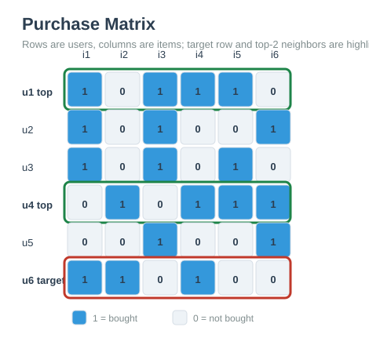
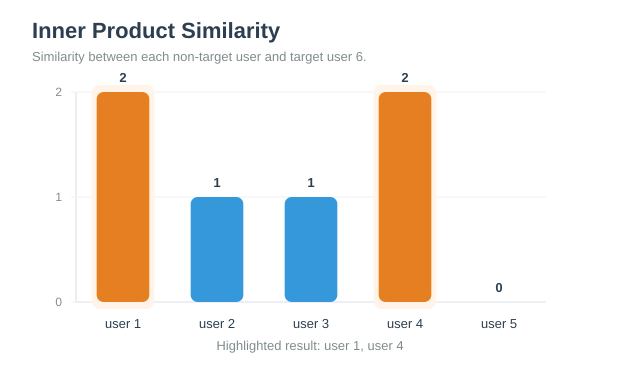
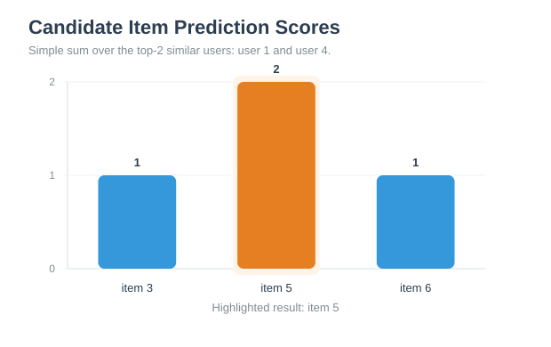
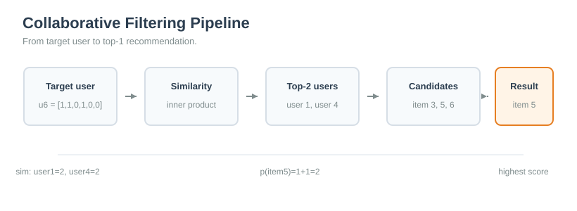

# L10 Assignment

**Name:** LI HAN
**Student ID:** 33C26029
**GitHub Repository:** https://github.com/HannisLee/assignment_big_data

## Problem Statement

In this assignment, we consider a recommendation task using **memory-based collaborative filtering**.

The user-item purchase matrix is:

$$
M =
\begin{bmatrix}
1 & 0 & 1 & 1 & 1 & 0 \\
1 & 0 & 1 & 0 & 0 & 1 \\
1 & 0 & 1 & 0 & 1 & 0 \\
0 & 1 & 0 & 1 & 1 & 1 \\
0 & 0 & 1 & 0 & 0 & 1 \\
1 & 1 & 0 & 1 & 0 & 0
\end{bmatrix}
$$

Each row represents one user, and each column represents one item. A value of $1$ means that the user has bought the item, while a value of $0$ means that the user has not bought the item.

The target user is the user in the **6th row**:

$$
u_{\text{target}} = [1, 1, 0, 1, 0, 0]
$$

The goal is to:

1. Compute the similarity between the target user and every other user.
2. Select the **top-2 most similar users**.
3. Find the items bought by these two users but not bought by the target user.
4. Predict each candidate item by a simple sum.
5. Recommend the **top-1 item** with the largest prediction score.

Similarity is measured by **inner product**:

$$
\text{sim}(u_i, u_{\text{target}}) = u_i \cdot u_{\text{target}}
$$

## Similarity Calculation

The target user vector is:

$$
u_6 = [1, 1, 0, 1, 0, 0]
$$

We compute the inner product between $u_6$ and each other user.

| user | user vector | inner product similarity |
|---:|---|---:|
| 1 | $[1,0,1,1,1,0]$ | $1\cdot1 + 0\cdot1 + 1\cdot0 + 1\cdot1 + 1\cdot0 + 0\cdot0 = 2$ |
| 2 | $[1,0,1,0,0,1]$ | $1\cdot1 + 0\cdot1 + 1\cdot0 + 0\cdot1 + 0\cdot0 + 1\cdot0 = 1$ |
| 3 | $[1,0,1,0,1,0]$ | $1\cdot1 + 0\cdot1 + 1\cdot0 + 0\cdot1 + 1\cdot0 + 0\cdot0 = 1$ |
| 4 | $[0,1,0,1,1,1]$ | $0\cdot1 + 1\cdot1 + 0\cdot0 + 1\cdot1 + 1\cdot0 + 1\cdot0 = 2$ |
| 5 | $[0,0,1,0,0,1]$ | $0\cdot1 + 0\cdot1 + 1\cdot0 + 0\cdot1 + 0\cdot0 + 1\cdot0 = 0$ |

Therefore, excluding the target user itself, the similarity scores are:

| user | similarity |
|---:|---:|
| 1 | 2 |
| 4 | 2 |
| 2 | 1 |
| 3 | 1 |
| 5 | 0 |

## Top-2 Similar Users

The two users with the highest similarity to the target user are:

$$
U = \{u_1, u_4\}
$$

Their purchase vectors are:

$$
u_1 = [1,0,1,1,1,0]
$$

$$
u_4 = [0,1,0,1,1,1]
$$

Both users have similarity score $2$ with the target user, so they are selected as the **top-2 similar users**.

## Candidate Items

The target user has already bought items 1, 2, and 4:

$$
u_{\text{target}} = [1,1,0,1,0,0]
$$

So the target user has **not** bought:

$$
\{ \text{item 3}, \text{item 5}, \text{item 6} \}
$$

Next, we look at the items bought by the top-2 similar users.

| item | bought by user 1? | bought by user 4? | bought by target user? | candidate? |
|---:|---:|---:|---:|---:|
| 1 | 1 | 0 | 1 | No |
| 2 | 0 | 1 | 1 | No |
| 3 | 1 | 0 | 0 | Yes |
| 4 | 1 | 1 | 1 | No |
| 5 | 1 | 1 | 0 | Yes |
| 6 | 0 | 1 | 0 | Yes |

Thus, the candidate items are:

$$
\{ \text{item 3}, \text{item 5}, \text{item 6} \}
$$

## Prediction by Simple Sum

For each candidate item, the prediction score is computed by:

$$
p(j) = \sum_{i \in U} m_{i,j}
$$

where $U = \{u_1, u_4\}$ is the set of top-2 similar users.

The prediction scores are:

| candidate item | user 1 value | user 4 value | prediction score $p(j)$ |
|---:|---:|---:|---:|
| item 3 | 1 | 0 | $1 + 0 = 1$ |
| item 5 | 1 | 1 | $1 + 1 = 2$ |
| item 6 | 0 | 1 | $0 + 1 = 1$ |

So the prediction vector over the candidate items is:

$$
p(\text{item 3}) = 1,\quad
p(\text{item 5}) = 2,\quad
p(\text{item 6}) = 1
$$

## Visualization

The purchase matrix shows all users and items. The target user is **user 6**, while the selected top-2 similar users are **user 1** and **user 4**.

The similarity chart confirms that user 1 and user 4 have the highest inner-product similarity with the target user.

Among the candidate items, item 5 has the largest simple-sum prediction score.

The full recommendation pipeline first computes similarity, then selects the top-2 similar users, generates candidate items, and finally recommends the item with the highest predicted score.

## Recommendation Result

The item with the highest prediction score is:

$$
\text{item 5}
$$

Therefore, the top-1 recommendation for the target user is:

$$
\text{Recommend item 5 to user 6}
$$

## Code

[main.py](https://github.com/HannisLee/assignment_big_data/blob/main/report10/main.py)

## Conclusion

Using memory-based collaborative filtering with inner-product similarity, the top-2 users most similar to the target user are **user 1** and **user 4**. Among the items bought by these similar users but not yet bought by the target user, the candidate items are **item 3**, **item 5**, and **item 6**.

After applying the simple-sum prediction rule, item 5 obtains the largest score:

$$
p(\text{item 5}) = 2
$$

Thus, the final recommendation result is:

$$
\text{item 5}
$$
