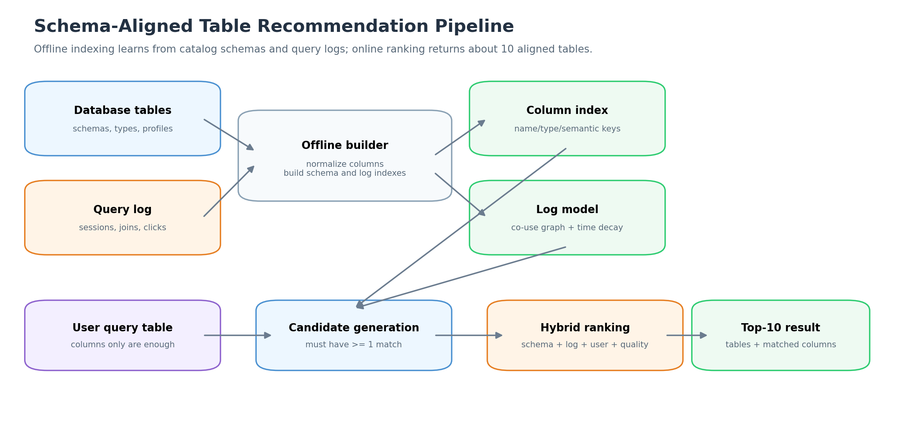
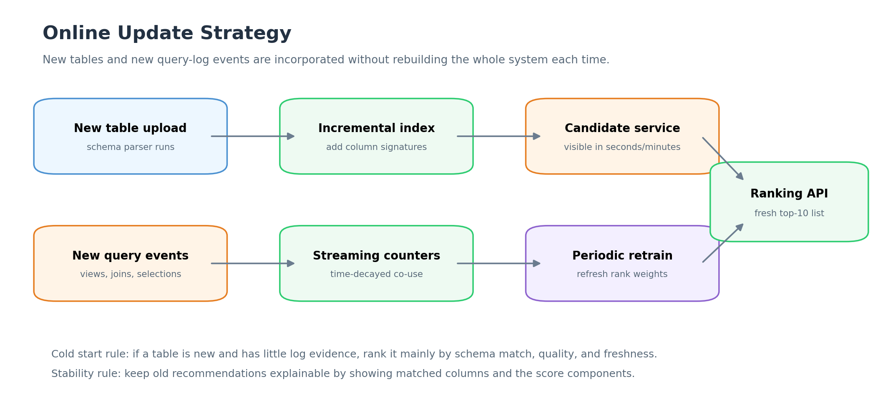
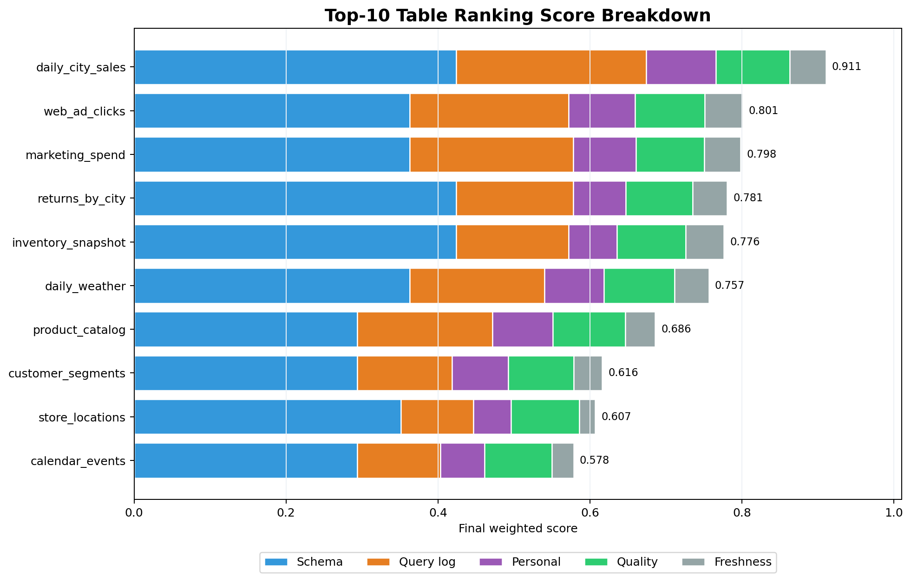

# L11 Assignment

**Name:** LI HAN
**Student ID:** 33C26029
**GitHub Repository:** https://github.com/HannisLee/assignment_big_data

## Problem Statement

In this assignment, we need to design a recommender system for a database of tables. Given a user's query table, the system should recommend around 10 tables that can be **schema-aligned** with the query table.

Here, a table is schema-aligned if it has **at least one matching column** with the query table. The query table shown in the lecture is only an example, so the system must work for arbitrary query tables. There are hundreds of users, and the database is updated continuously, similar to online video sharing systems where new content is uploaded every day.

## Design Goal

The goal is not simply to recommend the most popular tables. The recommended tables must first satisfy the schema-alignment condition, and then they should be ranked by usefulness.

Therefore, I design the system as a **two-stage recommender**:

1. **Candidate generation:** find all tables that have at least one column match with the query table.
2. **Ranking:** rank these candidate tables using schema similarity, query-log evidence, personalization, data quality, and freshness.

## System Architecture

The system contains two parts:

| Part | Main task | Output |
|---|---|---|
| Offline builder | Process database schemas and historical query logs | Column index, table co-use graph, ranking features |
| Online recommender | Accept a user's query table and return recommendations | Around 10 schema-aligned tables with matched-column explanations |

The offline part can be updated periodically or incrementally, while the online part must be fast enough to support interactive analysis.

## Table and Column Representation

Each table is represented by schema-level and usage-level information.

| Feature type | Examples | Purpose |
|---|---|---|
| Column name features | normalized names, tokens, synonyms | Match columns such as `sales` and `revenue` |
| Column type features | string, number, date, datetime | Avoid invalid matches such as date to numeric value |
| Data profile features | value range, null rate, distinct count | Improve matching when names are ambiguous |
| Table usage features | views, joins, session co-occurrence | Learn which tables are useful together |
| User features | user history, team history | Support personalization for hundreds of users |
| Operational features | freshness, quality score, access control | Handle online updates and production constraints |

For example, a query table may have the schema:

| Column | Type |
|---|---|
| city | string |
| date | date |
| sales | number |
| product_id | string |

The system then searches for tables with columns such as `city`, `date`, `revenue`, `warehouse_city`, or `product_id`.

## Candidate Generation

Candidate generation enforces the most important rule:

> A recommended table must have at least one matching column with the query table.

For a query column \(c_q\) and a database column \(c_t\), I define a column-match score:

$$
match(c_q, c_t) =
0.70 \times name\_sim(c_q, c_t)
+ 0.30 \times type\_compat(c_q, c_t)
$$

where:

- \(name\_sim\) compares normalized column names, tokens, and synonyms;
- \(type\_compat\) checks whether column types are compatible.

A database table \(T\) becomes a candidate if:

$$
\max_{c_q \in Q, c_t \in T} match(c_q, c_t) \ge \tau
$$

where \(Q\) is the query table and \(\tau\) is the matching threshold.

To make this efficient, the offline system builds an **inverted column index**:

| Index key | Example | Tables returned |
|---|---|---|
| normalized column name | `city` | tables containing `city` |
| token | `date` | tables containing `date`, `opening_date`, etc. |
| synonym group | `sales/revenue` | tables containing `sales`, `revenue`, `return_amount` |
| type bucket | `date`, `number`, `string` | tables with compatible column types |

The online system only needs to look up the query table's column keys and merge the returned candidates.

## Ranking Model

After candidate generation, each candidate table is ranked by a hybrid score:

$$
Score(Q,T,u) =
w_s S_{schema}
+ w_l S_{log}
+ w_p S_{personal}
+ w_q S_{quality}
+ w_f S_{fresh}
$$

where:

| Component | Meaning |
|---|---|
| $S_{schema}$ | How strongly table \(T\)'s columns match the query table \(Q\) |
| $S_{log}$ | How often table \(T\) is useful with similar query tables in historical query logs |
| $S_{personal}$ | How relevant table \(T\) is to the current user or user's group |
| $S_{quality}$ | Data quality, completeness, and reliability |
| $S_{fresh}$ | Whether the table is recently updated |

In a real system, the weights can be learned by a learning-to-rank model. In the Python demonstration, I use fixed weights:

$$
Score =
0.50 S_{schema}
+ 0.25 S_{log}
+ 0.10 S_{personal}
+ 0.10 S_{quality}
+ 0.05 S_{fresh}
$$

Schema matching is given the largest weight because the assignment requires schema-aligned recommendations. Query-log evidence is the second largest part because it captures how users actually use the database for analysis.

## Using the Query Log

The query log is important because it tells the system which tables are useful together. For hundreds of users, I would store the following events:

| Event | Example signal |
|---|---|
| Table view | user opened table \(T\) after using query table \(Q\) |
| Join or union | user joined \(Q\) with \(T\) |
| Query session | \(Q\) and \(T\) appeared in the same analysis session |
| Click or selection | user selected \(T\) from recommendations |
| Abandonment | user saw \(T\) but did not use it |

From these logs, the system can build a table co-use graph. If users often use `daily_city_sales` with `daily_weather`, then `daily_weather` should be ranked higher for a city-date sales query.

The log score can also use time decay:

$$
co\_use_{decayed}(Q,T) =
\sum_i \exp(-age_i / \lambda)
$$

This prevents very old behavior from dominating recent user needs.

## Handling Hundreds of Users

Since there are hundreds of users, the system should support both global and personal recommendations.

| Case | Strategy |
|---|---|
| Existing user | Use the user's past sessions and selected tables |
| New user | Fall back to schema match, global query-log score, freshness, and quality |
| Team or department | Aggregate usage at group level to reduce sparsity |
| Privacy | Use aggregated counts rather than exposing individual user logs |

This is similar to collaborative filtering: users who used similar tables in similar analytical sessions provide evidence for each other.

## Handling Database Updates

The database changes over time, so the recommender must handle new tables and new query-log events.

| Update type | Action |
|---|---|
| New table uploaded | Parse schema, compute column signatures, add to the inverted index |
| Table schema changed | Recompute only the affected table's schema features |
| New query-log event | Update streaming co-use counters and user profiles |
| Large accumulated changes | Periodically retrain ranking weights |
| Cold-start table | Rank mainly by schema match, quality, and freshness until enough logs exist |

This allows the recommender to recommend new useful tables quickly without rebuilding the whole system every time.

## Example Demonstration

The Python script simulates a query table:

$$
Q = \{city, date, sales, product\_id\}
$$

It then ranks tables from a small database catalog. The top-10 recommendation result is:

| Rank | Recommended table | Final score | Schema score | Log score | Matched columns |
|---:|---|---:|---:|---:|---|
| 1 | daily_city_sales | 0.911 | 0.848 | 1.000 | city->city, date->date, sales->revenue |
| 2 | web_ad_clicks | 0.801 | 0.725 | 0.838 | city->city, date->date |
| 3 | marketing_spend | 0.798 | 0.725 | 0.861 | city->city, date->date |
| 4 | returns_by_city | 0.781 | 0.848 | 0.618 | city->city, date->date, sales->return_amount |
| 5 | inventory_snapshot | 0.776 | 0.848 | 0.593 | city->warehouse_city, date->date, product_id->product_id |
| 6 | daily_weather | 0.757 | 0.725 | 0.710 | city->city, date->date |
| 7 | product_catalog | 0.686 | 0.588 | 0.711 | product_id->product_id |
| 8 | customer_segments | 0.616 | 0.588 | 0.499 | city->city |
| 9 | store_locations | 0.607 | 0.703 | 0.381 | city->city, date->opening_date |
| 10 | calendar_events | 0.578 | 0.588 | 0.438 | date->date |

Tables such as `support_tickets` and `supplier_contracts` are excluded because they do not have a strong enough column match with the query table.

## Score Visualization

The figure shows the contribution of each score component. For example, `daily_city_sales` has a very high schema score and a very high query-log score, so it becomes the top recommendation. Some tables, such as `product_catalog`, have only one strong matching column, but they are still useful because `product_id` is an important analytical key and the query log supports them.

## Algorithm Summary

The online recommendation algorithm is:

1. Receive the user's query table \(Q\).
2. Normalize all query column names and detect their types.
3. Use the inverted column index to retrieve candidate tables.
4. Keep only tables with at least one column match above threshold \(\tau\).
5. Compute schema score from matched columns.
6. Compute query-log score from historical co-use, joins, and selections.
7. Add personalization, quality, and freshness features.
8. Rank candidates by the final hybrid score.
9. Apply a small diversity step to avoid returning many near-duplicate tables.
10. Return around 10 tables with explanations of matched columns.

## Evaluation

The system can be evaluated offline and online.

| Metric | Meaning |
|---|---|
| Precision@10 | Fraction of recommended top-10 tables that users actually use |
| Recall@10 | Fraction of useful schema-aligned tables recovered in top-10 |
| NDCG@10 | Whether highly useful tables are ranked near the top |
| MRR | How soon the first useful table appears |
| Coverage | Fraction of query tables for which the system can recommend results |
| Latency | Time needed to return recommendations |
| Freshness | How quickly new tables become recommendable |

Labels can be obtained from future user actions, such as whether the user opens, joins, unions, or repeatedly uses a recommended table after seeing it.

## Code

[main.py](https://github.com/HannisLee/assignment_big_data/blob/main/report11/main.py)

## Conclusion

I would build the table recommender as a hybrid, two-stage system. The first stage guarantees schema alignment by retrieving only tables with at least one matching column. The second stage ranks these candidates using schema strength, historical query-log behavior, personalization, data quality, and freshness.

This design works for arbitrary query tables, scales to hundreds of users by using aggregated query-log signals, and supports daily database updates through incremental schema indexing and streaming log updates. The final output is a top-10 list of useful schema-aligned tables, together with matched-column explanations so that users can quickly understand why each table is recommended.

