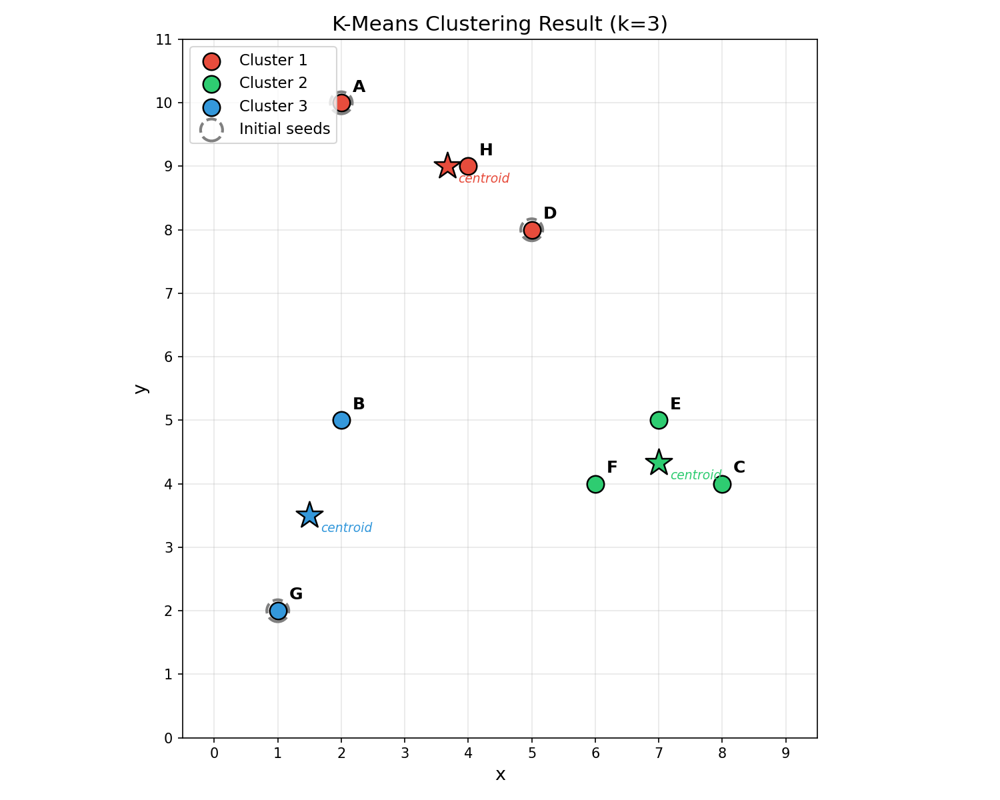

# L4 Assignment

**Name:** LI HAN 
**Student ID:** 33C26029 
**GitHub Repository:** https://github.com/HannisLee/assignment_big_data

## Problem Statement

Cluster the following 8 points using the k-means algorithm:

| ID | (x, y) |
|----|--------|
| A  | (2, 10) |
| B  | (2, 5) |
| C  | (8, 4) |
| D  | (5, 8) |
| E  | (7, 5) |
| F  | (6, 4) |
| G  | (1, 2) |
| H  | (4, 9) |

**Conditions:**
- Distance measure: Euclidean distance
- k = 3
- Initial seed points: A(2,10), D(5,8), G(1,2)

## Algorithm

The k-means algorithm proceeds as follows:

1. Choose k objects as initial seed points
2. Assign each object to the nearest seed point (using Euclidean distance)
3. Recompute each centroid as the mean of its assigned points
4. Repeat steps 2-3 until no assignments change

## Step-by-Step Calculation

### Iteration 1

**Centroids:** C1 = A(2, 10), C2 = D(5, 8), C3 = G(1, 2)

| Point | d(C1) | d(C2) | d(C3) | Assigned |
|-------|-------|-------|-------|----------|
| A(2,10) | **0.0000** | 3.6056 | 8.0623 | Cluster 1 |
| B(2,5) | 5.0000 | 4.2426 | **3.1623** | Cluster 3 |
| C(8,4) | 8.4853 | **5.0000** | 7.2801 | Cluster 2 |
| D(5,8) | 3.6056 | **0.0000** | 7.2111 | Cluster 2 |
| E(7,5) | 7.0711 | **3.6056** | 6.7082 | Cluster 2 |
| F(6,4) | 7.2111 | **4.1231** | 5.3852 | Cluster 2 |
| G(1,2) | 8.0623 | 7.2111 | **0.0000** | Cluster 3 |
| H(4,9) | 2.2361 | **1.4142** | 7.6158 | Cluster 2 |

**Assignments:** Cluster 1 = {A}, Cluster 2 = {C, D, E, F, H}, Cluster 3 = {B, G}

**Update centroids:**
- C1 = mean({A(2,10)}) = (2.0, 10.0) — unchanged
- C2 = mean({C(8,4), D(5,8), E(7,5), F(6,4), H(4,9)}) = ((8+5+7+6+4)/5, (4+8+5+4+9)/5) = (6.0, 6.0)
- C3 = mean({B(2,5), G(1,2)}) = ((2+1)/2, (5+2)/2) = (1.5, 3.5)

### Iteration 2

**Centroids:** C1 = (2, 10), C2 = (6, 6), C3 = (1.5, 3.5)

| Point | d(C1) | d(C2) | d(C3) | Assigned |
|-------|-------|-------|-------|----------|
| A(2,10) | **0.0000** | 5.6569 | 6.5192 | Cluster 1 |
| B(2,5) | 5.0000 | 4.1231 | **1.5811** | Cluster 3 |
| C(8,4) | 8.4853 | **2.8284** | 6.5192 | Cluster 2 |
| D(5,8) | 3.6056 | **2.2361** | 5.7009 | Cluster 2 |
| E(7,5) | 7.0711 | **1.4142** | 5.7009 | Cluster 2 |
| F(6,4) | 7.2111 | **2.0000** | 4.5277 | Cluster 2 |
| G(1,2) | 8.0623 | 6.4031 | **1.5811** | Cluster 3 |
| H(4,9) | **2.2361** | 3.6056 | 6.0415 | Cluster 1 ← **moved** |

**Assignments:** Cluster 1 = {A, H}, Cluster 2 = {C, D, E, F}, Cluster 3 = {B, G}

*H moved from Cluster 2 to Cluster 1.*

**Update centroids:**
- C1 = mean({A(2,10), H(4,9)}) = (3.0, 9.5)
- C2 = mean({C(8,4), D(5,8), E(7,5), F(6,4)}) = (6.5, 5.25)
- C3 = mean({B(2,5), G(1,2)}) = (1.5, 3.5) — unchanged

### Iteration 3

**Centroids:** C1 = (3, 9.5), C2 = (6.5, 5.25), C3 = (1.5, 3.5)

| Point | d(C1) | d(C2) | d(C3) | Assigned |
|-------|-------|-------|-------|----------|
| A(2,10) | **1.1180** | 6.5431 | 6.5192 | Cluster 1 |
| B(2,5) | 4.6098 | 4.5069 | **1.5811** | Cluster 3 |
| C(8,4) | 7.4330 | **1.9526** | 6.5192 | Cluster 2 |
| D(5,8) | **2.5000** | 3.1325 | 5.7009 | Cluster 1 ← **moved** |
| E(7,5) | 6.0208 | **0.5590** | 5.7009 | Cluster 2 |
| F(6,4) | 6.2650 | **1.3463** | 4.5277 | Cluster 2 |
| G(1,2) | 7.7621 | 6.3885 | **1.5811** | Cluster 3 |
| H(4,9) | **1.1180** | 4.5069 | 6.0415 | Cluster 1 |

**Assignments:** Cluster 1 = {A, D, H}, Cluster 2 = {C, E, F}, Cluster 3 = {B, G}

*D moved from Cluster 2 to Cluster 1.*

**Update centroids:**
- C1 = mean({A(2,10), D(5,8), H(4,9)}) = (11/3, 27/3) ≈ (3.6667, 9.0)
- C2 = mean({C(8,4), E(7,5), F(6,4)}) = (7.0, 13/3) ≈ (7.0, 4.3333)
- C3 = mean({B(2,5), G(1,2)}) = (1.5, 3.5) — unchanged

### Iteration 4

**Centroids:** C1 = (3.6667, 9.0), C2 = (7.0, 4.3333), C3 = (1.5, 3.5)

| Point | d(C1) | d(C2) | d(C3) | Assigned |
|-------|-------|-------|-------|----------|
| A(2,10) | **1.9437** | 7.5572 | 6.5192 | Cluster 1 |
| B(2,5) | 4.3333 | 5.0442 | **1.5811** | Cluster 3 |
| C(8,4) | 6.6165 | **1.0541** | 6.5192 | Cluster 2 |
| D(5,8) | **1.6667** | 4.1767 | 5.7009 | Cluster 1 |
| E(7,5) | 5.2068 | **0.6667** | 5.7009 | Cluster 2 |
| F(6,4) | 5.5176 | **1.0541** | 4.5277 | Cluster 2 |
| G(1,2) | 7.4907 | 6.4377 | **1.5811** | Cluster 3 |
| H(4,9) | **0.3333** | 5.5478 | 6.0415 | Cluster 1 |

**Assignments:** Cluster 1 = {A, D, H}, Cluster 2 = {C, E, F}, Cluster 3 = {B, G}

**No change from Iteration 3 — algorithm converged.**

## Final Result

| Cluster | Points | Final Centroid |
|---------|--------|---------------|
| Cluster 1 | A, D, H | (3.67, 9.00) |
| Cluster 2 | C, E, F | (7.00, 4.33) |
| Cluster 3 | B, G | (1.50, 3.50) |

Converged after **4 iterations** (3 reassignment rounds + 1 verification).



## Code

main.py

```python
import sys
import io
import numpy as np


# ============================================================
# Data
# ============================================================
point_ids = ['A', 'B', 'C', 'D', 'E', 'F', 'G', 'H']
points = np.array([
    [2, 10],  # A
    [2, 5],   # B
    [8, 4],   # C
    [5, 8],   # D
    [7, 5],   # E
    [6, 4],   # F
    [1, 2],   # G
    [4, 9],   # H
])

k = 3
# Initial seed points: A(2,10), D(5,8), G(1,2)
seed_indices = [0, 3, 6]  # A, D, G
cluster_names = ['Cluster 1 (seed A)', 'Cluster 2 (seed D)', 'Cluster 3 (seed G)']

centroids = points[seed_indices].copy().astype(float)
assignments = np.full(len(points), -1, dtype=int)

print("=" * 70)
print("K-Means Clustering")
print("=" * 70)
print(f"Points: {', '.join(f'{pid}({p[0]},{p[1]})' for pid, p in zip(point_ids, points))}")
print(f"k = {k}")
print(f"Initial seeds: {', '.join(f'{point_ids[i]}({points[i][0]},{points[i][1]})' for i in seed_indices)}")
print()


def euclidean(a, b):
    return np.sqrt(np.sum((a - b) ** 2))


iteration = 0
while True:
    iteration += 1
    print("=" * 70)
    print(f"Iteration {iteration}")
    print("=" * 70)
    print(f"\nCurrent centroids:")
    for c_idx in range(k):
        print(f"  {cluster_names[c_idx]}: ({centroids[c_idx][0]:.4f}, {centroids[c_idx][1]:.4f})")
    print()

    # Compute distances
    print("Distance from each point to each centroid:")
    header = f"{'Point':<8}"
    for c_idx in range(k):
        short_name = f"C{c_idx+1}({centroids[c_idx][0]:.2f},{centroids[c_idx][1]:.2f})"
        header += f"{short_name:<22}"
    header += f"{'Assignment':<14}"
    print(header)
    print("-" * len(header))

    new_assignments = np.full(len(points), -1, dtype=int)
    distances = np.zeros((len(points), k))

    for i in range(len(points)):
        row = f"{point_ids[i]}({points[i][0]},{points[i][1]})    "
        for c_idx in range(k):
            d = euclidean(points[i], centroids[c_idx])
            distances[i, c_idx] = d
            row += f"{d:<22.4f}"
        nearest = np.argmin(distances[i])
        new_assignments[i] = nearest
        row += f"{cluster_names[nearest]}"
        print(row)

    print()

    # Show cluster membership
    print("Cluster assignments:")
    for c_idx in range(k):
        members = [point_ids[i] for i in range(len(points)) if new_assignments[i] == c_idx]
        print(f"  {cluster_names[c_idx]}: {', '.join(members)}")
    print()

    # Check convergence
    if np.array_equal(new_assignments, assignments):
        print(">>> No change in assignments. Algorithm CONVERGED.")
        break

    assignments = new_assignments.copy()

    # Update centroids
    print("Updating centroids (mean of assigned points):")
    for c_idx in range(k):
        mask = new_assignments == c_idx
        member_points = points[mask]
        new_centroid = member_points.mean(axis=0)
        old_c = centroids[c_idx].copy()
        centroids[c_idx] = new_centroid
        members_str = ', '.join([f"{point_ids[i]}({points[i][0]},{points[i][1]})" for i in range(len(points)) if new_assignments[i] == c_idx])
        print(f"  {cluster_names[c_idx]}: members = [{members_str}]")
        print(f"    old centroid = ({old_c[0]:.4f}, {old_c[1]:.4f})")
        print(f"    new centroid = ({new_centroid[0]:.4f}, {new_centroid[1]:.4f})")
    print()

# Final result
print()
print("=" * 70)
print("FINAL RESULT")
print("=" * 70)
print(f"\nTotal iterations: {iteration}")
print()
print("Final cluster assignments:")
for c_idx in range(k):
    members = [point_ids[i] for i in range(len(points)) if assignments[i] == c_idx]
    print(f"  Cluster {c_idx+1}: {', '.join(members)} (centroid: ({centroids[c_idx][0]:.4f}, {centroids[c_idx][1]:.4f}))")

# Save data for plotting
np.savez('report4/kmeans_data.npz',
         points=points,
         point_ids=np.array(point_ids),
         assignments=assignments,
         centroids=centroids,
         initial_seeds=points[seed_indices],
         seed_indices=np.array(seed_indices))

print("\nData saved to report4/kmeans_data.npz")

```

plot.py

```python
import numpy as np
import matplotlib
matplotlib.use('Agg')
import matplotlib.pyplot as plt

# ============================================================
# Load data from main.py
# ============================================================
data = np.load('report4/kmeans_data.npz', allow_pickle=True)
points = data['points']
point_ids = data['point_ids']
assignments = data['assignments']
centroids = data['centroids']
initial_seeds = data['initial_seeds']

colors = ['#e74c3c', '#2ecc71', '#3498db']
cluster_labels = ['Cluster 1', 'Cluster 2', 'Cluster 3']

fig, ax = plt.subplots(figsize=(10, 8))

# Plot points colored by cluster
for c_idx in range(3):
    mask = assignments == c_idx
    cluster_pts = points[mask]
    ids = point_ids[mask]
    ax.scatter(cluster_pts[:, 0], cluster_pts[:, 1],
               c=colors[c_idx], s=150, label=cluster_labels[c_idx],
               edgecolors='black', linewidths=1.2, zorder=3)
    for pt, pid in zip(cluster_pts, ids):
        ax.annotate(str(pid), (pt[0], pt[1]),
                    textcoords="offset points", xytext=(8, 8),
                    fontsize=12, fontweight='bold')

# Plot initial seeds (dashed outline)
ax.scatter(initial_seeds[:, 0], initial_seeds[:, 1],
           c='none', s=250, edgecolors='gray', linewidths=2,
           linestyles='dashed', label='Initial seeds', zorder=2)

# Plot final centroids (star marker)
for c_idx in range(3):
    ax.scatter(centroids[c_idx, 0], centroids[c_idx, 1],
               marker='*', s=400, c=colors[c_idx], edgecolors='black',
               linewidths=1.2, zorder=4)
    ax.annotate(f'centroid', (centroids[c_idx, 0], centroids[c_idx, 1]),
                textcoords="offset points", xytext=(8, -12),
                fontsize=9, fontstyle='italic', color=colors[c_idx])

ax.set_xlabel('x', fontsize=13)
ax.set_ylabel('y', fontsize=13)
ax.set_title('K-Means Clustering Result (k=3)', fontsize=15)
ax.legend(fontsize=11, loc='upper left')
ax.set_xlim(-0.5, 9.5)
ax.set_ylim(0.5, 11)
ax.set_aspect('equal')
ax.grid(True, alpha=0.3)
ax.set_xticks(range(0, 10))
ax.set_yticks(range(0, 12))

fig.tight_layout()
fig.savefig('report4/kmeans_result.png', dpi=150)
plt.close(fig)
print("kmeans_result.png saved")

```
