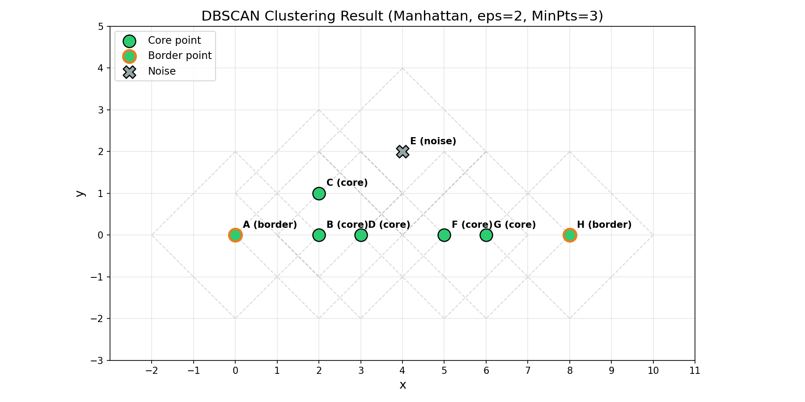

# L5 Assignment

**Name:** LI HAN
**Student ID:** 33C26029
**GitHub Repository:** https://github.com/HannisLee/assignment_big_data

## Problem Statement

Cluster the following 8 points using the DBSCAN algorithm:

| ID | (x, y) |
|----|--------|
| A  | (0, 0) |
| B  | (2, 0) |
| C  | (2, 1) |
| D  | (3, 0) |
| E  | (4, 2) |
| F  | (5, 0) |
| G  | (6, 0) |
| H  | (8, 0) |

**Conditions:**
- Distance measure: Manhattan distance (L1 norm)
- epsilon (eps) = 2
- MinPts = 3
- Processing order: A → B → C → D → E → F → G → H

## Algorithm

The DBSCAN (Density-Based Spatial Clustering of Applications with Noise) algorithm proceeds as follows:

1. For each unvisited point p (in the specified order):
   - Mark p as visited
   - Retrieve all points in its eps-neighborhood: N_eps(p) = {q | dist(p, q) ≤ eps}
   - If |N_eps(p)| < MinPts: mark p as noise (may later be changed to border point)
   - If |N_eps(p)| ≥ MinPts: p is a **core point** — create a new cluster and expand it
2. Cluster expansion from core point p:
   - For each point q in N_eps(p) that is not yet assigned to a cluster:
     - Assign q to the current cluster
     - If q is also a core point, recursively expand using q's neighborhood
   - Points previously labeled as noise can be reclaimed as **border points** if reached from a core point

## Step-by-Step Calculation

### 1.Manhattan Distance Matrix

Manhattan distance: d(p, q) = |x₁ - x₂| + |y₁ - y₂|

|   | A | B | C | D | E | F | G | H |
|---|---|---|---|---|---|---|---|---|
| **A** | 0 | 2 | 3 | 3 | 6 | 5 | 6 | 8 |
| **B** | 2 | 0 | 1 | 1 | 4 | 3 | 4 | 6 |
| **C** | 3 | 1 | 0 | 2 | 3 | 4 | 5 | 7 |
| **D** | 3 | 1 | 2 | 0 | 3 | 2 | 3 | 5 |
| **E** | 6 | 4 | 3 | 3 | 0 | 3 | 4 | 6 |
| **F** | 5 | 3 | 4 | 2 | 3 | 0 | 1 | 3 |
| **G** | 6 | 4 | 5 | 3 | 4 | 1 | 0 | 2 |
| **H** | 8 | 6 | 7 | 5 | 6 | 3 | 2 | 0 |

### Epsilon Neighborhoods (eps = 2)

| Point | N_eps(point) | N_eps | Type     |
| :---: | :----------- | :---: | :------- |
| **A** | {A, B}       |   2   | Non-core |
| **B** | {A, B, C, D} |   4   | **Core** |
| **C** | {B, C, D}    |   3   | **Core** |
| **D** | {B, C, D, F} |   4   | **Core** |
| **E** | {E}          |   1   | Non-core |
| **F** | {D, F, G}    |   3   | **Core** |
| **G** | {F, G, H}    |   3   | **Core** |
| **H** | {G, H}       |   2   | Non-core |

### Processing Point A(0,0)

- N_eps(A) = {A, B}, |N_eps| = 2
- 2 < MinPts = 3 → A is marked as **NOISE**

### Processing Point B(2,0)

- N_eps(B) = {A, B, C, D}, |N_eps| = 4
- 4 ≥ MinPts = 3 → B is a **CORE** point
- Create **Cluster 1**, assign B to Cluster 1
- **Expand Cluster 1 from B:**
  - **A(0,0)**: was NOISE → reassigned to Cluster 1 as **border point**
  - **C(2,1)**: assigned to Cluster 1 (visited)
    - C is CORE (|N_eps| = 3), expanding cluster...
  - **D(3,0)**: assigned to Cluster 1 (visited)
    - D is CORE (|N_eps| = 4), expanding cluster...
  - **F(5,0)**: assigned to Cluster 1 (visited)
    - F is CORE (|N_eps| = 3), expanding cluster...
  - **G(6,0)**: assigned to Cluster 1 (visited)
    - G is CORE (|N_eps| = 3), expanding cluster...
  - **H(8,0)**: assigned to Cluster 1 (visited) as **border point**

### Processing Point C(2,1)

- Already visited → Cluster 1

### Processing Point D(3,0)

- Already visited → Cluster 1

### Processing Point E(4,2)

- N_eps(E) = {E}, |N_eps| = 1
- 1 < MinPts = 3 → E is marked as **NOISE**

### Processing Point F(5,0)

- Already visited → Cluster 1

### Processing Point G(6,0)

- Already visited → Cluster 1

### Processing Point H(8,0)

- Already visited → Cluster 1

## Final Result

| Point | Type | Cluster |
|-------|------|---------|
| A | Border | Cluster 1 |
| B | Core | Cluster 1 |
| C | Core | Cluster 1 |
| D | Core | Cluster 1 |
| E | Noise | - |
| F | Core | Cluster 1 |
| G | Core | Cluster 1 |
| H | Border | Cluster 1 |

**Cluster 1:** {A, B, C, D, F, G, H}

- Core points: {B, C, D, F, G}
- Border points: {A, H}

**Noise:** {E}



## Code

main.py

```python
import sys
import io
import numpy as np
from collections import deque

sys.stdout = io.TextIOWrapper(sys.stdout.buffer, encoding='utf-8')

# ============================================================
# Data
# ============================================================
point_ids = ['A', 'B', 'C', 'D', 'E', 'F', 'G', 'H']
points = np.array([
    [0, 0],  # A
    [2, 0],  # B
    [2, 1],  # C
    [3, 0],  # D
    [4, 2],  # E
    [5, 0],  # F
    [6, 0],  # G
    [8, 0],  # H
])

eps = 2
minpts = 3


def manhattan(a, b):
    return np.sum(np.abs(a - b))


# ============================================================
# Print header
# ============================================================
print("=" * 70)
print("DBSCAN Clustering")
print("=" * 70)
print(f"Points: {', '.join(f'{pid}({p[0]},{p[1]})' for pid, p in zip(point_ids, points))}")
print(f"Distance: Manhattan (L1)")
print(f"eps = {eps}, MinPts = {minpts}")
print(f"Processing order: {' → '.join(point_ids)}")
print()

# ============================================================
# Distance matrix
# ============================================================
n = len(points)
dist_matrix = np.zeros((n, n))
for i in range(n):
    for j in range(n):
        dist_matrix[i, j] = manhattan(points[i], points[j])

print("=" * 70)
print("Manhattan Distance Matrix")
print("=" * 70)
header = f"{'':>6}"
for pid in point_ids:
    header += f"{pid:>6}"
print(header)
print("-" * (6 + 6 * n))
for i in range(n):
    row = f"{point_ids[i]:>6}"
    for j in range(n):
        row += f"{int(dist_matrix[i, j]):>6}"
    print(row)
print()

# ============================================================
# Epsilon neighborhoods
# ============================================================
print("=" * 70)
print(f"Epsilon Neighborhoods (eps = {eps})")
print("=" * 70)
neighborhoods = []
for i in range(n):
    neighbors = [j for j in range(n) if dist_matrix[i, j] <= eps]
    neighborhoods.append(neighbors)
    neighbor_ids = [point_ids[j] for j in neighbors]
    is_core = "Core" if len(neighbors) >= minpts else "Non-core"
    print(f"  N_eps({point_ids[i]}) = {{{', '.join(neighbor_ids)}}}, |N_eps| = {len(neighbors)} → {is_core}")
print()

# ============================================================
# Core point summary
# ============================================================
print("=" * 70)
print("Core Point Identification (|N_eps| >= MinPts)")
print("=" * 70)
print(f"{'Point':<8} {'|N_eps|':<10} {'MinPts':<10} {'Type':<12}")
print("-" * 40)
for i in range(n):
    ptype = "Core" if len(neighborhoods[i]) >= minpts else "Non-core"
    print(f"{point_ids[i]:<8} {len(neighborhoods[i]):<10} {minpts:<10} {ptype:<12}")
print()

# ============================================================
# DBSCAN Algorithm
# ============================================================
print("=" * 70)
print("DBSCAN Algorithm Execution")
print("=" * 70)
print()

UNDEFINED = -1
NOISE = -2

labels = np.full(n, UNDEFINED, dtype=int)
visited = set()
cluster_id = -1


def expand_cluster(p_idx, cluster_id):
    queue = deque()
    for nb in neighborhoods[p_idx]:
        if labels[nb] == UNDEFINED or labels[nb] == NOISE:
            queue.append(nb)

    while queue:
        q_idx = queue.popleft()

        if labels[q_idx] == NOISE:
            labels[q_idx] = cluster_id
            print(f"      {point_ids[q_idx]}({points[q_idx][0]},{points[q_idx][1]}) was NOISE → now assigned to Cluster {cluster_id + 1} (border point)")

        if labels[q_idx] != UNDEFINED:
            continue

        labels[q_idx] = cluster_id
        if q_idx not in visited:
            visited.add(q_idx)
            print(f"      {point_ids[q_idx]}({points[q_idx][0]},{points[q_idx][1]}) → assigned to Cluster {cluster_id + 1} (visited)")

        q_neighbors = neighborhoods[q_idx]
        if len(q_neighbors) >= minpts:
            print(f"      {point_ids[q_idx]} is CORE (|N_eps| = {len(q_neighbors)}), expanding cluster...")
            for nb in q_neighbors:
                if labels[nb] == UNDEFINED or labels[nb] == NOISE:
                    queue.append(nb)


# Process each point in alphabetical order
for i in range(n):
    pid = point_ids[i]
    px, py = points[i]

    print(f"Processing point {pid}({px},{py})")

    if i in visited:
        current_label = labels[i]
        if current_label == NOISE:
            print(f"  {pid} already visited → NOISE")
        elif current_label >= 0:
            print(f"  {pid} already visited → Cluster {current_label + 1}")
        print()
        continue

    visited.add(i)
    neighbors = neighborhoods[i]
    neighbor_ids_str = ', '.join(point_ids[j] for j in neighbors)

    print(f"  N_eps({pid}) = {{{neighbor_ids_str}}}, |N_eps| = {len(neighbors)}")

    if len(neighbors) < minpts:
        labels[i] = NOISE
        print(f"  |N_eps| = {len(neighbors)} < MinPts = {minpts} → {pid} marked as NOISE")
        print()
        continue

    cluster_id += 1
    labels[i] = cluster_id
    print(f"  |N_eps| = {len(neighbors)} >= MinPts = {minpts} → {pid} is CORE point")
    print(f"  Create Cluster {cluster_id + 1}, assigning {pid} to Cluster {cluster_id + 1}")
    print(f"  Expanding Cluster {cluster_id + 1} from {pid}...")

    expand_cluster(i, cluster_id)
    print()

# ============================================================
# Final Result
# ============================================================
print()
print("=" * 70)
print("FINAL RESULT")
print("=" * 70)
print()

num_clusters = cluster_id + 1
print(f"Number of clusters: {num_clusters}")
print()

for c in range(num_clusters):
    members = [point_ids[i] for i in range(n) if labels[i] == c]
    core_pts = [point_ids[i] for i in range(n) if labels[i] == c and len(neighborhoods[i]) >= minpts]
    border_pts = [point_ids[i] for i in range(n) if labels[i] == c and len(neighborhoods[i]) < minpts]
    print(f"  Cluster {c + 1}: {{{', '.join(members)}}}")
    print(f"    Core points: {{{', '.join(core_pts)}}}")
    print(f"    Border points: {{{', '.join(border_pts)}}}")

noise_pts = [point_ids[i] for i in range(n) if labels[i] == NOISE]
print(f"  Noise: {{{', '.join(noise_pts)}}}")
print()

# Summary table
print(f"{'Point':<8} {'Type':<10} {'Cluster':<12}")
print("-" * 30)
for i in range(n):
    if labels[i] >= 0:
        ptype = "Core" if len(neighborhoods[i]) >= minpts else "Border"
        cluster_str = f"Cluster {labels[i] + 1}"
    else:
        ptype = "Noise"
        cluster_str = "-"
    print(f"{point_ids[i]:<8} {ptype:<10} {cluster_str:<12}")

# ============================================================
# Save data for plotting
# ============================================================
plot_labels = labels.copy().astype(int)

np.savez('report5/dbscan_data.npz',
         points=points,
         point_ids=np.array(point_ids),
         labels=plot_labels,
         distance_matrix=dist_matrix,
         neighborhoods=np.array([np.array(nb) for nb in neighborhoods], dtype=object),
         eps=eps,
         minpts=minpts,
         num_clusters=num_clusters)

print("\nData saved to report5/dbscan_data.npz")
```

plots.py

```python
import numpy as np
import matplotlib
matplotlib.use('Agg')
import matplotlib.pyplot as plt
from matplotlib.patches import Polygon as MplPolygon

# ============================================================
# Load data from main.py
# ============================================================
data = np.load('report5/dbscan_data.npz', allow_pickle=True)
points = data['points']
point_ids = data['point_ids']
labels = data['labels']
eps = int(data['eps'])
minpts = int(data['minpts'])
neighborhoods = data['neighborhoods']

n = len(points)

# ============================================================
# Classify points
# ============================================================
cluster_color = '#2ecc71'
noise_color = '#95a5a6'

core_indices = []
border_indices = []
noise_indices = []

for i in range(n):
    if labels[i] < 0:
        noise_indices.append(i)
    elif len(neighborhoods[i]) >= minpts:
        core_indices.append(i)
    else:
        border_indices.append(i)

fig, ax = plt.subplots(figsize=(12, 6))

# Draw Manhattan epsilon diamonds (L1 ball) for each point
for i in range(n):
    x, y = points[i]
    diamond = MplPolygon(
        [[x, y + eps], [x + eps, y], [x, y - eps], [x - eps, y]],
        fill=False, edgecolor='gray', linestyle='--', alpha=0.3, linewidth=1
    )
    ax.add_patch(diamond)

# Plot cluster core points
if core_indices:
    core_pts = points[core_indices]
    ax.scatter(core_pts[:, 0], core_pts[:, 1],
               c=cluster_color, s=180, label='Core point',
               edgecolors='black', linewidths=1.2, zorder=3)

# Plot cluster border points
if border_indices:
    border_pts = points[border_indices]
    ax.scatter(border_pts[:, 0], border_pts[:, 1],
               c=cluster_color, s=180, label='Border point',
               edgecolors='#e67e22', linewidths=2.5, zorder=3)

# Plot noise points
if noise_indices:
    noise_pts = points[noise_indices]
    ax.scatter(noise_pts[:, 0], noise_pts[:, 1],
               c=noise_color, s=180, marker='X', label='Noise',
               edgecolors='black', linewidths=1.2, zorder=3)

# Annotate each point with its ID and type
for i in range(n):
    x, y = points[i]
    pid = point_ids[i]
    if labels[i] < 0:
        ann = f'{pid} (noise)'
    elif len(neighborhoods[i]) >= minpts:
        ann = f'{pid} (core)'
    else:
        ann = f'{pid} (border)'
    ax.annotate(ann, (x, y),
                textcoords="offset points", xytext=(8, 8),
                fontsize=10, fontweight='bold')

ax.set_xlabel('x', fontsize=13)
ax.set_ylabel('y', fontsize=13)
ax.set_title(f'DBSCAN Clustering Result (Manhattan, eps={eps}, MinPts={minpts})', fontsize=15)
ax.legend(fontsize=11, loc='upper left')
ax.set_xlim(-3, 11)
ax.set_ylim(-3, 5)
ax.set_aspect('equal')
ax.grid(True, alpha=0.3)
ax.set_xticks(range(-2, 12))
ax.set_yticks(range(-3, 6))

fig.tight_layout()
fig.savefig('report5/dbscan_result.png', dpi=150)
plt.close(fig)
print("dbscan_result.png saved")
```
