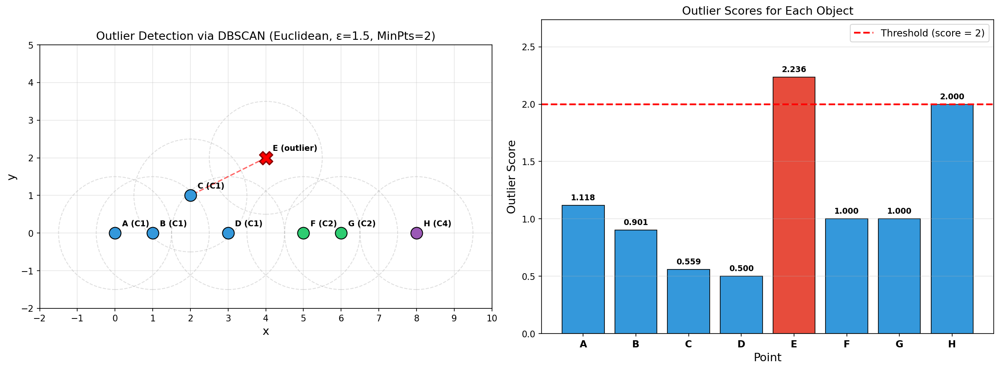

# L6 Assignment

**Name:** LI HAN
**Student ID:** 33C26029
**GitHub Repository:** https://github.com/HannisLee/assignment_big_data

## Problem Statement

Consider the following eight objects. Our task is to detect outliers using clustering-based method.

**Data:**

| ID | (x, y) |
|----|--------|
| A  | (0, 0) |
| B  | (1, 0) |
| C  | (2, 1) |
| D  | (3, 0) |
| E  | (4, 2) |
| F  | (5, 0) |
| G  | (6, 0) |
| H  | (8, 0) |

**Conditions:**
- Distance measure: Euclidean distance (L2 norm)
- DBSCAN parameters: ε = 1.5, MinPts = 2
- Processing order: A → B → C → D → E → F → G → H
- Unclustered objects are treated as single-object clusters

**Outlier scoring:**

$$\text{score}(o) = \frac{\text{dist}(o,\, o')}{|c|}$$

- $o'$: nearest object to $o$ in **another cluster**
- $|c|$: number of objects in $o$'s cluster
- If score > 2 → outlier

## Algorithm

This problem involves two phases:

**Phase 1 — DBSCAN Clustering:**

1. For each unvisited point p (in alphabetical order):
   - Mark p as visited
   - Retrieve ε-neighborhood: N_eps(p) = {q | dist(p, q) ≤ ε}
   - If |N_eps(p)| < MinPts: mark as noise (may later become border point)
   - If |N_eps(p)| ≥ MinPts: p is a **core point** — create a new cluster and expand
2. Cluster expansion: assign reachable points to the cluster; if they are also core points, continue expanding recursively
3. Noise points are treated as single-object clusters for scoring

**Phase 2 — Outlier Score Computation:**

For each object o, find the nearest object o' in a **different** cluster, then compute score(o) = dist(o, o') / |c|. Objects with score > 2 are outliers.

## Step-by-Step Calculation

### 1. Euclidean Distance Matrix

Euclidean distance: $d(p, q) = \sqrt{(x_1 - x_2)^2 + (y_1 - y_2)^2}$

|      |    A |    B |    C |    D |    E |    F |    G |    H |
|------|------|------|------|------|------|------|------|------|
| **A** | 0    | 1    | 2.236| 3    | 4.472| 5    | 6    | 8    |
| **B** | 1    | 0    | 1.414| 2    | 3.606| 4    | 5    | 7    |
| **C** | 2.236| 1.414| 0    | 1.414| 2.236| 3.162| 4.123| 6.083|
| **D** | 3    | 2    | 1.414| 0    | 2.236| 2    | 3    | 5    |
| **E** | 4.472| 3.606| 2.236| 2.236| 0    | 2.236| 2.828| 4.472|
| **F** | 5    | 4    | 3.162| 2    | 2.236| 0    | 1    | 3    |
| **G** | 6    | 5    | 4.123| 3    | 2.828| 1    | 0    | 2    |
| **H** | 8    | 7    | 6.083| 5    | 4.472| 3    | 2    | 0    |

### 2. Epsilon Neighborhoods (ε = 1.5)

| Point | N_eps(point)        | \|N_eps\| | Type     |
|:-----:|:--------------------|:--------:|:---------|
| **A** | {A, B}              | 2        | **Core** |
| **B** | {A, B, C}           | 3        | **Core** |
| **C** | {B, C, D}           | 3        | **Core** |
| **D** | {C, D}              | 2        | **Core** |
| **E** | {E}                 | 1        | Non-core |
| **F** | {F, G}              | 2        | **Core** |
| **G** | {F, G}              | 2        | **Core** |
| **H** | {H}                 | 1        | Non-core |

### 3. DBSCAN Execution

#### Processing A(0,0)
- N_eps(A) = {A, B}, |N_eps| = 2
- 2 ≥ MinPts = 2 → A is **CORE**
- Create **Cluster 1**, assign A to Cluster 1
- **Expand Cluster 1 from A:**
  - **B(1,0)**: assigned to Cluster 1
    - B is CORE (|N_eps| = 3), expanding...
  - **C(2,1)**: assigned to Cluster 1
    - C is CORE (|N_eps| = 3), expanding...
  - **D(3,0)**: assigned to Cluster 1
    - D is CORE (|N_eps| = 2), expanding...

#### Processing B(1,0)
- Already visited → Cluster 1

#### Processing C(2,1)
- Already visited → Cluster 1

#### Processing D(3,0)
- Already visited → Cluster 1

#### Processing E(4,2)
- N_eps(E) = {E}, |N_eps| = 1
- 1 < MinPts = 2 → E is marked as **NOISE**

#### Processing F(5,0)
- N_eps(F) = {F, G}, |N_eps| = 2
- 2 ≥ MinPts = 2 → F is **CORE**
- Create **Cluster 2**, assign F to Cluster 2
- **Expand Cluster 2 from F:**
  - **G(6,0)**: assigned to Cluster 2
    - G is CORE (|N_eps| = 2), expanding...

#### Processing G(6,0)
- Already visited → Cluster 2

#### Processing H(8,0)
- N_eps(H) = {H}, |N_eps| = 1
- 1 < MinPts = 2 → H is marked as **NOISE**

### 4. Treat Noise as Single-Object Clusters

| Original | Cluster |
|----------|---------|
| {A, B, C, D} | Cluster 1 (|c| = 4) |
| {F, G} | Cluster 2 (|c| = 2) |
| {E} (noise) | Cluster 3 (|c| = 1) |
| {H} (noise) | Cluster 4 (|c| = 1) |

### 5. Outlier Score Computation

For each object o, find the nearest object o' in **another** cluster, then compute score(o) = dist(o, o') / |c|:

**A (Cluster 1, |c| = 4):**
- Nearest in other clusters: E (C3) at √20 ≈ 4.472
- score(A) = 4.472 / 4 = **1.118**

**B (Cluster 1, |c| = 4):**
- Nearest in other clusters: E (C3) at √13 ≈ 3.606
- score(B) = 3.606 / 4 = **0.901**

**C (Cluster 1, |c| = 4):**
- Nearest in other clusters: E (C3) at √5 ≈ 2.236
- score(C) = 2.236 / 4 = **0.559**

**D (Cluster 1, |c| = 4):**
- Nearest in other clusters: F (C2) at 2.000
- score(D) = 2.000 / 4 = **0.500**

**E (Cluster 3, |c| = 1):**
- Nearest in other clusters: C (C1) at √5 ≈ 2.236
- score(E) = 2.236 / 1 = **2.236 > 2 → OUTLIER**

**F (Cluster 2, |c| = 2):**
- Nearest in other clusters: D (C1) at 2.000
- score(F) = 2.000 / 2 = **1.000**

**G (Cluster 2, |c| = 2):**
- Nearest in other clusters: H (C4) at 2.000
- score(G) = 2.000 / 2 = **1.000**

**H (Cluster 4, |c| = 1):**
- Nearest in other clusters: G (C2) at 2.000
- score(H) = 2.000 / 1 = **2.000** (not > 2, not an outlier)

## Final Result

| Point | Cluster | \|c\| | o'  | dist(o, o') | score | Outlier? |
|-------|---------|------|-----|-------------|-------|----------|
| A     | C1      | 4    | E   | 4.472       | 1.118 | No       |
| B     | C1      | 4    | E   | 3.606       | 0.901 | No       |
| C     | C1      | 4    | E   | 2.236       | 0.559 | No       |
| D     | C1      | 4    | F   | 2.000       | 0.500 | No       |
| E     | C3      | 1    | C   | 2.236       | 2.236 | **YES**  |
| F     | C2      | 2    | D   | 2.000       | 1.000 | No       |
| G     | C2      | 2    | H   | 2.000       | 1.000 | No       |
| H     | C4      | 1    | G   | 2.000       | 2.000 | No       |

**Detected outlier: E(4, 2)**

E is the only object whose score (2.236) exceeds the threshold of 2. Note that H has a score of exactly 2.0, which does **not** exceed the threshold (score must be strictly greater than 2).

## Code

[main.py](https://github.com/HannisLee/assignment_big_data/blob/main/report6/main.py)

[plots.py](https://github.com/HannisLee/assignment_big_data/blob/main/report6/plots.py)

## Conclusion

In this assignment, we applied a clustering-based outlier detection method using DBSCAN on eight 2D objects. With ε = 1.5 and MinPts = 2 (Euclidean distance), DBSCAN produced two clusters — Cluster 1 {A, B, C, D} and Cluster 2 {F, G} — while E and H were left as noise and treated as single-object clusters.

The outlier scoring formula score(o) = dist(o, o') / |c| penalizes objects that are far from other clusters relative to their own cluster size. Object E(4,2) received a score of 2.236 (greater than the threshold of 2), making it the only detected outlier. Its high score comes from being isolated (|c| = 1) while being at a distance of √5 ≈ 2.236 from its nearest neighbor in another cluster. Object H(8,0) also sits in a single-object cluster but has a score of exactly 2.0, which does not exceed the threshold.
