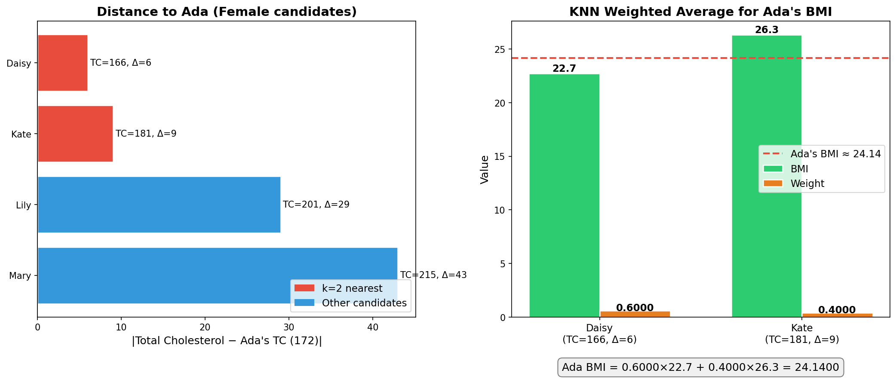

# L7 Assignment

**Name:** LI HAN
**Student ID:** 33C26029
**GitHub Repository:** https://github.com/HannisLee/assignment_big_data

## Problem Statement

We have blood test data collected from professors. Ada's BMI is missing. We need to fill in the missing value using **k-Nearest Neighbors (KNN)** imputation.

**Data:**

| Name  | Gender     | Age | Position             | BMI  | Drink        | Smoke | Total Cholesterol |
|-------|------------|-----|----------------------|------|--------------|-------|-------------------|
| Ada   | Female     | 39  | Associate Professor  | ?    | Occasionally | No    | 172               |
| Alex  | Male       | 53  | Professor            | 31.7 | Often        | Yes   | 255               |
| Bill  | Male       | 25  | Assistant Professor  | 20.5 | No           | No    | 159               |
| Daisy | Female     | 28  | Assistant Professor  | 22.7 | Occasionally | No    | 166               |
| David | Male       | 45  | Professor            | 30.2 | Often        | Yes   | 242               |
| John  | Male       | 37  | Associate Professor  | 21.6 | No           | Yes   | 180               |
| Kate  | Female     | 48  | Professor            | 26.3 | Occasionally | Yes   | 181               |
| Lewis | Two-spirit | 40  | Associate Professor  | 24.4 | Occasionally | No    | 192               |
| Lily  | Female     | 52  | Professor            | 28.0 | Occasionally | No    | 201               |
| Mary  | Female     | 43  | Associate Professor  | 28.6 | Often        | No    | 215               |

**Conditions:**
- k = 2
- Distance metric: absolute difference in **Total Cholesterol**
- Filter: only consider **same gender class** (Female)
- Imputation: **weighted average** of the k-nearest neighbors' BMI, where weights are proportional to the reciprocal of the distance and sum to 1

## Algorithm

**KNN Imputation** fills a missing value by:

1. **Filter**: Select only candidates from the same gender class as the target (Ada is Female).
2. **Distance**: Compute the distance between Ada and each candidate using the absolute difference in Total Cholesterol.
3. **Select k-nearest**: Sort by distance and pick the k closest neighbors.
4. **Weighted average**: Compute Ada's BMI as a weighted average of the neighbors' BMIs, where each weight is proportional to $1 / d_i$ (reciprocal of distance) and all weights sum to 1.

$$\text{BMI}_{\text{Ada}} = \sum_{i=1}^{k} w_i \times \text{BMI}_i, \quad w_i = \frac{1/d_i}{\sum_{j=1}^{k} 1/d_j}$$

## Step-by-Step Calculation

### Step 1: Filter Same Gender (Female)

Ada is Female, so we only consider the other Female candidates:

| Name  | BMI  | Total Cholesterol |
|-------|------|-------------------|
| Daisy | 22.7 | 166               |
| Kate  | 26.3 | 181               |
| Lily  | 28.0 | 201               |
| Mary  | 28.6 | 215               |

### Step 2: Compute Distances

Distance = |Total Cholesterol − Ada's Total Cholesterol| = |TC − 172|

| Name  | TC  | \|TC − 172\| |
|-------|-----|:------------:|
| Daisy | 166 | **6**        |
| Kate  | 181 | **9**        |
| Lily  | 201 | 29           |
| Mary  | 215 | 43           |

### Step 3: Select k = 2 Nearest Neighbors

Sorted by distance, the 2 nearest neighbors are:

| Rank | Name  | TC  | Distance |
|------|-------|-----|----------|
| 1    | Daisy | 166 | 6        |
| 2    | Kate  | 181 | 9        |

### Step 4: Compute Weights

Raw reciprocal weights:

$$w_{\text{Daisy}}^{\text{raw}} = \frac{1}{6} = 0.16667, \quad w_{\text{Kate}}^{\text{raw}} = \frac{1}{9} = 0.11111$$

Sum of raw weights:

$$\sum = 0.16667 + 0.11111 = 0.27778$$

Normalized weights (sum to 1):

$$w_{\text{Daisy}} = \frac{0.16667}{0.27778} = \frac{3}{5} = 0.6$$

$$w_{\text{Kate}} = \frac{0.11111}{0.27778} = \frac{2}{5} = 0.4$$

### Step 5: Weighted Average

$$\text{BMI}_{\text{Ada}} = w_{\text{Daisy}} \times \text{BMI}_{\text{Daisy}} + w_{\text{Kate}} \times \text{BMI}_{\text{Kate}}$$

$$= 0.6 \times 22.7 + 0.4 \times 26.3$$

$$= 13.62 + 10.52 = \boxed{24.14}$$

## Visualization

The left plot shows the distance (absolute difference in Total Cholesterol) from each female candidate to Ada. The 2 nearest neighbors (Daisy and Kate) are highlighted in red. The right plot shows each neighbor's BMI and normalized weight, with the red dashed line indicating Ada's estimated BMI of 24.14.

## Final Result

| Item | Value |
|------|-------|
| Ada's Total Cholesterol | 172 |
| k | 2 |
| Neighbor 1 | Daisy (TC = 166, distance = 6, BMI = 22.7, weight = 0.6) |
| Neighbor 2 | Kate (TC = 181, distance = 9, BMI = 26.3, weight = 0.4) |
| **Ada's estimated BMI** | **24.14** |

## Code

[main.py](https://github.com/HannisLee/assignment_big_data/blob/main/report7/main.py)

## Conclusion

In this assignment, we applied k-Nearest Neighbors (KNN) imputation to fill in Ada's missing BMI value. After filtering for same-gender (Female) candidates, we computed the absolute difference in Total Cholesterol as the distance metric. With k = 2, the nearest neighbors were **Daisy** (distance = 6) and **Kate** (distance = 9). Using a weighted average where weights are proportional to the reciprocal of the distance (and normalized to sum to 1), we obtained Ada's estimated BMI as **24.14** — a reasonable value that falls between her two neighbors' BMIs (22.7 and 26.3), weighted more heavily toward the closer neighbor Daisy.
