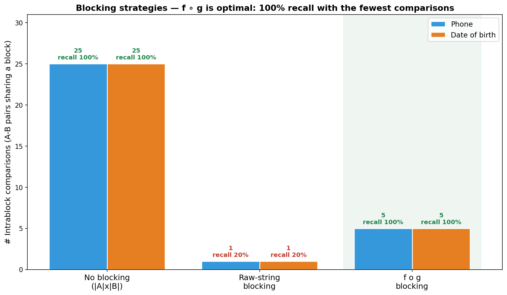
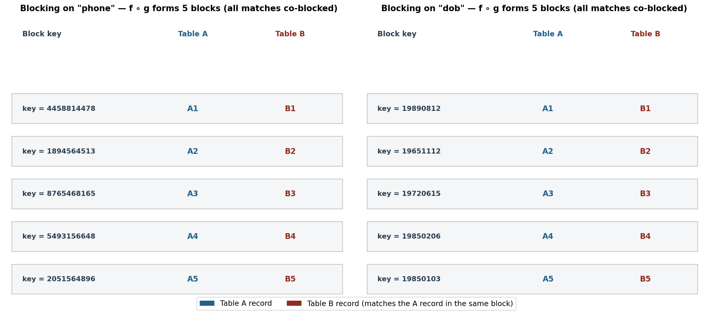

# L8 Assignment

**Name:** LI HAN
**Student ID:** 33C26029
**GitHub Repository:** https://github.com/HannisLee/assignment_big_data

## Problem Statement

We consider an **entity linkage** problem between two tables, A and B, that describe the same set of people in different (and inconsistent) formats. We must design a **blocking rule** for each of two blocking attributes so that:

1. **All matching records are identified** by the blocking rule (every true A↔B match shares a block) — i.e., 100% *recall*.
2. The **total number of pairwise intrablock comparisons** is **as small as possible**.

The blocking rule is applied on **raw data**. Any normalization we need must be injected into the rule itself, i.e. we use the composition **f ∘ g**, where **g** is a transformation applied to the raw value and **f** is the function that produces the block key on top of g.

### Table A

| Name | Phone | Date of Birth | State |
|--------|--------|--------|--------|
| Smith, John | 445-881-4478 | August 12, 1989 | Maine |
| Jennifer Tal | +1-189-456-4513 | 11/12/1965 | Tx |
| Gates, Bill | (876)546-8165 | June 15, 1972 | Kansas |
| Alan Fitch | 5493156648 | 2-6-1985 | Oh |
| Jacob Alan | (205)1564896 | 1985 January 3 | Alabama |

### Table B

| Name | Phone | Date of Birth | State |
|--------|--------|--------|--------|
| John Smith | 445-881-4478 | 08/12/1989 | Maine |
| Jennifer Tal | 189-456-4513 | 11/12/1965 | Tx |
| Bill Gates | 876-546-8165 | 06/15/1972 | Kansas |
| Alan Fitch | 549-315-6648 | 02/06/1985 | Oh |
| Jacob Alan | 205-156-4896 | 01/03/1985 | Alabama |

## Background

- **Blocking** puts records that share a common (or similar) attribute into the same *block*, so that record comparison (the expensive step) only happens *within* blocks instead of across the whole Cartesian product. Blocks may overlap when multiple rules are combined.
- **Block key**: the value produced by the blocking rule **f ∘ g**; records with an identical block key fall in the same block.
- **Intrablock comparison**: for a block *b*, every record of A in *b* is compared with every record of B in *b*. The total workload is

$$\text{comparisons} \;=\; \sum_{b} |A_b| \cdot |B_b|$$

Without blocking the baseline is $|A|\times|B| = 5\times 5 = 25$ candidate pairs.

- **Recall** = (number of true matching pairs that share a block) ÷ (total true matching pairs). Goal (1) requires recall = 100%.

The two goals are in tension: a very fine rule keeps blocks small (few comparisons) but may split a true match across different blocks (low recall); a very coarse rule never splits matches but creates large blocks (many comparisons). The **f ∘ g** composition lets us first *normalize* the raw value with **g** (restoring recall that raw strings destroy) and then choose **f** as tightly as the cleaned data allows (minimizing comparisons).

## Design of Blocking Rules

The five ground-truth matching pairs are **A1↔B1, A2↔B2, A3↔B3, A4↔B4, A5↔B5**. A quick look shows that **raw-string blocking fails recall**: across the two tables only one phone pair (`445-881-4478`) and one DOB pair (`11/12/1965`) are byte-identical — every other match is written in a different format. The transformation **g** is therefore essential.

### 1. Blocking attribute = "phone"

- **g(phone)** = keep digits only; if the result has 11 digits and starts with `1`, drop the leading country code → a canonical **10-digit** string.
- **f(x)** = **x** (identity): the block key is the full canonical 10-digit number.

Why **f = identity**? After **g**, every pair reconciles exactly with *no residual noise*, and all five entities have distinct phone numbers. The tightest possible block key (exact match on the full canonical value) therefore yields the smallest blocks — each of size 2 — which is both necessary and sufficient for goal (1) and minimal for goal (2). A coarser **f** (e.g., the last 7 digits) could only *merge* distinct entities into bigger blocks, increasing comparisons without buying any recall.

**Canonical block keys:** `4458814478, 1894564513, 8765468165, 5493156648, 2051564896` → **5 blocks, each of size 2**.

### 2. Blocking attribute = "date of birth"

- **g(dob)** = parse month names (January…December) and numeric `MM/DD/YYYY` (with `/` or `-` separators) into a canonical **`YYYYMMDD`** string.
- **f(x)** = **x** (identity): the block key is the full `YYYYMMDD`.

**Format assumption — US `MM/DD/YYYY`.** This is forced by the data itself: the month-name rows disambiguate the numeric ones. A1 *"August 12, 1989"* ↔ B1 *"08/12/1989"* fixes `08`=August=month; A3 *"June 15, 1972"* ↔ B3 *"06/15/1972"* fixes `06`=June=month; A5 *"January 3"* ↔ B5 *"01/03/1985"* fixes `01`=January=month. Hence A4 *"2-6-1985"* and B4 *"02/06/1985"* are both February 6. No matching pair is affected by any ambiguity.

**Canonical block keys:** `19890812, 19651112, 19720615, 19850206, 19850103` → **5 blocks, each of size 2**.

Again **f = identity** is optimal: using a coarser **f** such as *birth year* would merge the two 1985 babies (A4/B4 and A5/B5) into one block of four, raising that block's comparisons from $1$ to $2\!\times\!2=4$ and the total from **5 to 7** — strictly worse, with no gain in recall.

## Step-by-Step Calculation

### Step 1: Apply the transformation g to every raw value

| ID | Phone (raw) → g(phone) | DOB (raw) → g(dob) |
|----|------------------------|--------------------|
| A1 | `445-881-4478` → **4458814478** | `August 12, 1989` → **19890812** |
| A2 | `+1-189-456-4513` → **1894564513** | `11/12/1965` → **19651112** |
| A3 | `(876)546-8165` → **8765468165** | `June 15, 1972` → **19720615** |
| A4 | `5493156648` → **5493156648** | `2-6-1985` → **19850206** |
| A5 | `(205)1564896` → **2051564896** | `1985 January 3` → **19850103** |
| B1 | `445-881-4478` → **4458814478** | `08/12/1989` → **19890812** |
| B2 | `189-456-4513` → **1894564513** | `11/12/1965` → **19651112** |
| B3 | `876-546-8165` → **8765468165** | `06/15/1972` → **19720615** |
| B4 | `549-315-6648` → **5493156648** | `02/06/1985` → **19850206** |
| B5 | `205-156-4896` → **2051564896** | `01/03/1985` → **19850103** |

After **g**, each A_i and its matching B_i produce an **identical** canonical value.

### Step 2: Form blocks under f ∘ g (block key = canonical value)

**Phone**

| Block key | Table A | Table B |
|-----------|---------|---------|
| 4458814478 | A1 | B1 |
| 1894564513 | A2 | B2 |
| 8765468165 | A3 | B3 |
| 5493156648 | A4 | B4 |
| 2051564896 | A5 | B5 |

**Date of birth**

| Block key | Table A | Table B |
|-----------|---------|---------|
| 19890812 | A1 | B1 |
| 19651112 | A2 | B2 |
| 19720615 | A3 | B3 |
| 19850206 | A4 | B4 |
| 19850103 | A5 | B5 |

Every block contains exactly one A record and one B record, and every block is a true match.

### Step 3: Count comparisons and recall

Each block has $|A_b|\!=\!1,\;|B_b|\!=\!1$, contributing $1\!\times\!1=1$ comparison. With 5 blocks:

$$\text{comparisons} \;=\; \sum_{b=1}^{5} 1\cdot 1 \;=\; \boxed{5}, \qquad \text{recall} \;=\; \frac{5}{5} \;=\; \boxed{100\%}$$

Comparison against the alternatives (same for both attributes):

| Strategy | Comparisons | Recall | Meets goals? |
|----------|:-----------:|:------:|:------------:|
| No blocking ($|A|\!\times\!|B|$) | 25 | 100% | ✗ fails (2) |
| Raw-string blocking (no g) | 1 | **20%** | ✗ fails (1) |
| **f ∘ g (this design)** | **5** | **100%** | **✓ both** |

Raw-string blocking looks "efficient" (1 comparison) but it only co-blocks 1 of the 5 true matches, so it **violates goal (1)**. Our **f ∘ g** rule achieves the **theoretical minimum** of 5 comparisons — each true pair compared exactly once, no false pair ever compared — at 100% recall.

## Visualization

The chart compares the three strategies for both attributes. No-blocking needs all 25 A–B pairs but guarantees 100% recall; raw-string blocking collapses to 1 comparison yet only retains 20% recall (the format differences split the true matches); the **f ∘ g** rule lands on the optimal sweet spot — only **5 comparisons** while keeping **100% recall** (highlighted).

The two panels show the five blocks formed for each attribute. Every block is a single matched A–B pair sharing one canonical block key, confirming that **all five matches are co-blocked** (goal 1) and that **no two distinct entities collide** in the same block (which is why 5 comparisons already suffice — goal 2).

## Final Result

| Attribute | Transformation **g** | **f** | # Blocks | # Comparisons | Recall |
|-----------|----------------------|-------|:--------:|:-------------:|:------:|
| phone | digits only, strip leading country code `1` | identity (full 10-digit key) | 5 | **5** | **100%** |
| date of birth | month-name / `MM/DD/YYYY` → `YYYYMMDD` | identity (full date key) | 5 | **5** | **100%** |

Both blocking rules reduce the workload from **25** to **5** pairwise comparisons (a 5× reduction) while identifying **all** matching records — satisfying both design goals.

## Code

[main.py](https://github.com/HannisLee/assignment_big_data/blob/main/report8/main.py)

## Conclusion

The central lesson is that **the transformation g is what restores recall**: applied to raw strings, blocking finds only 1 of the 5 true matches (20% recall) because the same entity is written in wildly different formats (`(876)546-8165` vs `876-546-8165`; `August 12, 1989` vs `08/12/1989`). By injecting normalization into the rule — stripping non-digits and the country code for phones, and parsing month names and US `MM/DD/YYYY` dates into `YYYYMMDD` for dates of birth — every matching pair produces an identical block key.

Because g leaves **no residual noise** (the post-normalization values are clean and unique per entity), the **tightest** choice of f, namely identity / exact match on the full canonical value, is both feasible and optimal: it yields five blocks of size 2, i.e. exactly **5 comparisons** at **100% recall** — the theoretical minimum for this data, and a 5× reduction over the no-blocking baseline. A coarser f (e.g., birth year) would only merge unrelated entities into larger blocks and raise the comparison count, with no recall benefit. Both attributes thus admit a blocking rule that simultaneously satisfies goal (1) and goal (2).
