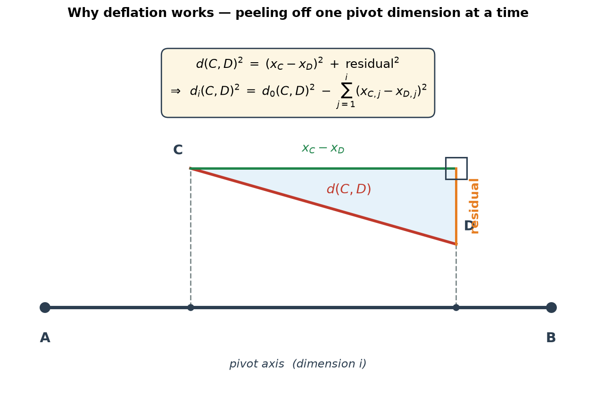
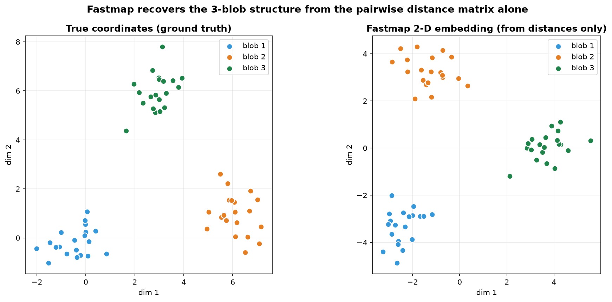
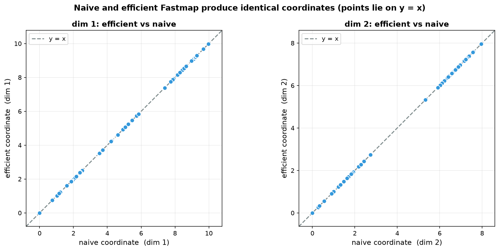
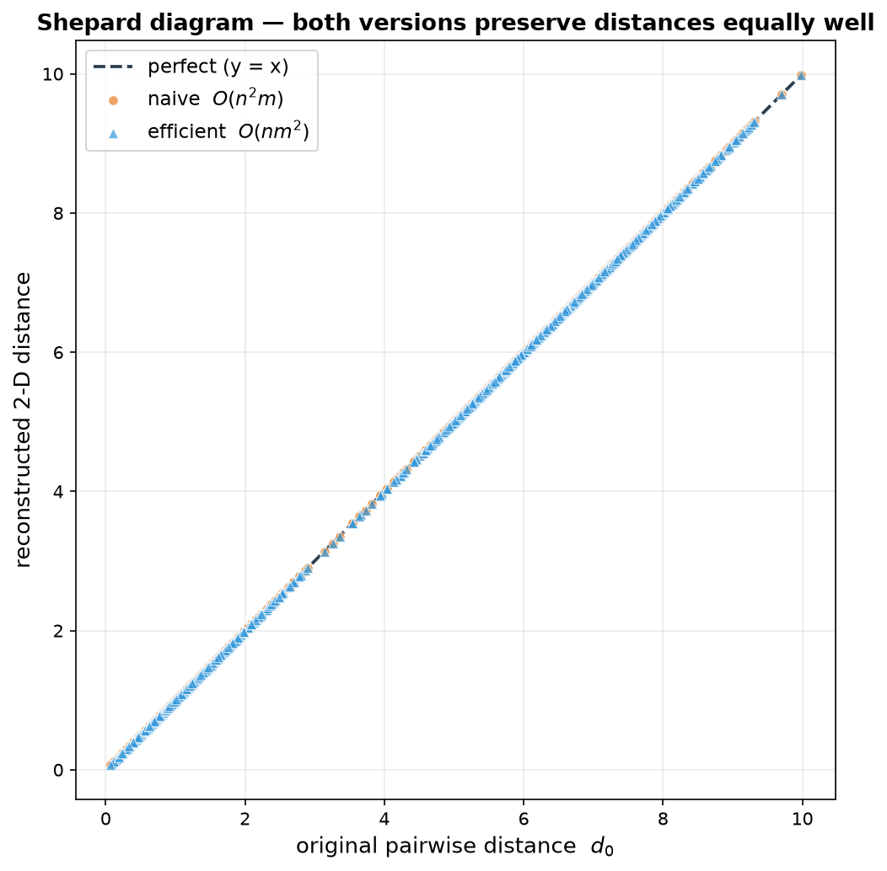
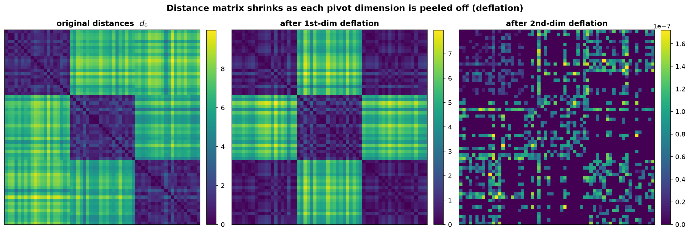
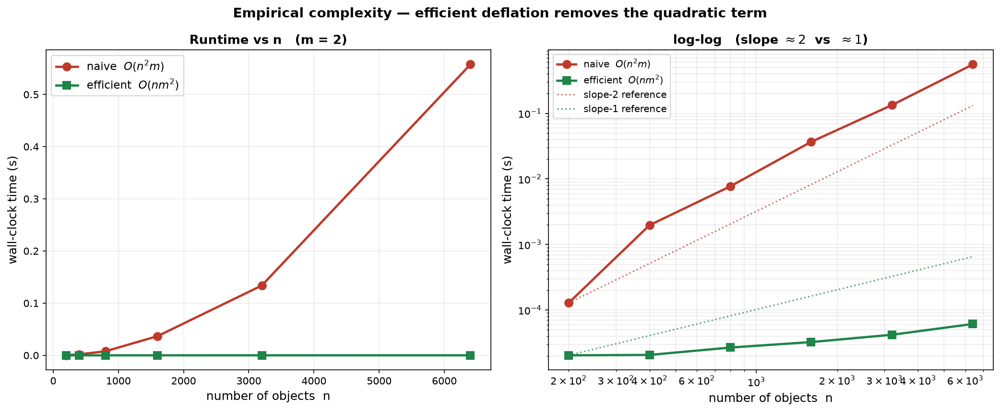

# L9 Assignment

**Name:** LI HAN
**Student ID:** 33C26029
**GitHub Repository:** https://github.com/HannisLee/assignment_big_data

## Problem Statement

Fastmap embeds $n$ objects — given **only their pairwise distances** — into an $m$-dimensional space ($m = 2$ or $3$ for visualization). At each iteration it picks a far-apart *pivot pair* $(A,B)$, projects every object $C$ onto the line $AB$, and then **deflates** the distance matrix by subtracting the squared projection just extracted, so that the next iteration works on the residual distances perpendicular to $AB$.

The deflation rewrites the entire $n\times n$ distance matrix, costing $O(n^2)$ per dimension and therefore

$$T_{\text{naive}} \;=\; O(n^2 m)$$

overall — not scalable. The lecture notes claim Fastmap can run in $O(nm^2)$. **How do we implement it to actually reach that complexity?**

The original pseudo-code (from the lecture notes):

```text
Fastmap(O, d, m):
    for i = 1 to m
        A, B := SelectLine(O, d)
        for each C in O
            x_{C,i} := (d_AB^2 + d_AC^2 - d_BC^2) / 2 d_AB
        d := Deflate(O, d, x, i)        # <-- rewrites the WHOLE n x n matrix
    return x
```

The answer, in one sentence: **delete the eager `Deflate` pass and instead compute each residual distance on demand from the original distance matrix and the coordinates already assigned.** Fastmap only ever reads $O(n)$ distances per iteration, so the full-matrix rewrite is pure waste.

## Background

- **Projection.** Once the pivot pair $(A,B)$ is chosen, object $C$'s coordinate on the $AB$ axis is the standard projection (the cosine rule):

$$x_{C,i} \;=\; \frac{d(A,C)^2 + d(A,B)^2 - d(B,C)^2}{2\,d(A,B)}$$

- **Deflation.** After the $i$-th dimension is fixed, the part of each distance *explained* by that dimension — the squared difference of the new coordinates — is removed so the next iteration sees only the perpendicular residual:

$$d'(C,D)^2 \;=\; d(C,D)^2 \;-\; \bigl(x_{C,i} - x_{D,i}\bigr)^2$$

- **Crucial fact.** The deflation is *separable across dimensions*. Applying it dimension by dimension telescopes into a single closed form — the residual after $i$ dimensions equals the **original** distance squared minus the sum of squared coordinate differences over all dimensions assigned so far. This is what makes the eager rewrite unnecessary.

## Where the $O(n^2 m)$ Comes From

The `Deflate(O, d, x, i)` call loops over **every pair** $(C,D)$ — all $\tfrac12 n(n{-}1)$ of them — and updates each entry. Done once per dimension:

$$T_{\text{Deflate}} \;=\; \underbrace{O(n^2)}_{\text{every pair}} \times m \;=\; O(n^2 m)$$

But notice what Fastmap actually *reads* in the iteration that follows: `SelectLine` scans distances from one or two pivots to everyone ($\approx 2n$ distances), and the projection reads $d(A,C)$ and $d(B,C)$ for each $C$ ($\approx 2n$ distances). That is **$O(n)$ distances per iteration** — the other $n^2 - O(n)$ entries that `Deflate` so expensively rewrote are **never looked at**. The eager deflation spends $O(n^2)$ to maintain a full matrix of which only $O(n)$ entries are ever used. That is the waste we remove.

## Key Idea: Lazy (On-Demand) Deflation

Keep the **original** distance matrix $d_0$ read-only, and never materialize a deflated copy. Whenever the algorithm needs the residual distance between $C$ and $D$ at iteration $i$, compute it on the fly using the telescoped identity:

$$\boxed{\;\;d_{i-1}(C,D)^2 \;=\; d_0(C,D)^2 \;-\; \sum_{j=1}^{i-1}\bigl(x_{C,j} - x_{D,j}\bigr)^2\;\;}$$

The function

```
residual_sq(C, D, i):          # cost O(i) <= O(m)
    s := d0(C,D)^2
    for j = 1 .. i-1:
        s -= (X[C,j] - X[D,j])^2
    return s
```

replaces both `Deflate` and the lookup `d(C,D)`. Because only $O(n)$ such queries are issued per iteration, the $O(n^2)$ matrix pass simply disappears.

## Revised Algorithm — $O(nm^2)$

```text
Fastmap(O, d0, m):                      # d0 = ORIGINAL distance matrix (read-only)
    X := n x m array of zeros
    for i = 1 to m:
        A, B := SelectLine(d0, X, i)    # uses residual_sq(.,., i) on demand
        for each C in O:
            X[C,i] := ( residual_sq(A,C,i) + residual_sq(A,B,i)
                        - residual_sq(B,C,i) ) / (2 * sqrt(residual_sq(A,B,i)))
    return X                            # NO Deflate() call at all
```

**Work count.** Each `residual_sq` costs $O(i) \le O(m)$.

- `SelectLine` (farthest-pair heuristic): pick any object $p$; $A := \arg\max_C d_{i-1}(p,C)$, then $B := \arg\max_C d_{i-1}(A,C)$ — $O(n)$ queries.
- Projection: $d_{i-1}(A,C)$ and $d_{i-1}(B,C)$ for every $C$ — $O(n)$ queries.

So iteration $i$ does $O(n)$ queries $\times\, O(i)$ work $= O(ni)$. Summing over $i=1\ldots m$:

$$\boxed{\;\;T_{\text{efficient}} \;=\; \sum_{i=1}^{m} O(ni) \;=\; O\!\bigl(n m^2\bigr)\;\;}$$

## Correctness: Naive $\equiv$ Efficient

The telescoped identity is not an approximation — it is the *exact* recursion the eager deflation performs, just unrolled. Therefore at every iteration the on-demand `residual_sq` returns the same value the materialized matrix would hold, the same pivot pair $(A,B)$ is selected, and the same coordinates are produced. The optimization changes the **cost**, never the **output**.

In the implementation (`main.py`) the two versions agree to a maximum coordinate difference of $\boxed{0}$ — bit-for-bit identical on this data.

## Visualization



The projection of $C$ and $D$ onto the pivot axis $AB$ turns their distance into a right triangle: the horizontal leg is the coordinate difference $(x_C - x_D)$ — the part *explained* by dimension $i$ — and what remains is the perpendicular residual. Pythagoras gives $d(C,D)^2 = (x_C - x_D)^2 + \text{residual}^2$, so subtracting $(x_C - x_D)^2$ from the squared distance leaves exactly the residual for the next iteration. Iterating this over all assigned dimensions yields the telescoped identity that lets us deflate on demand instead of rewriting the matrix.



Sixty points drawn from three Gaussian blobs (left) are reduced to their $60\times 60$ pairwise distance matrix, and **only that matrix** is handed to Fastmap. The recovered 2-D embedding (right, rigidly aligned to the truth) reproduces the three clusters and their relative layout. This is the payoff of the lecture: when objects have no natural coordinates — only distances — Fastmap manufactures a 2-D picture that preserves the geometry.



Plotting each object's efficient coordinate against its naive coordinate (both dimensions) puts every point exactly on the $y=x$ line. The lazy-deflation version is therefore a drop-in replacement: it returns the *same* embedding as the original algorithm while running in $O(nm^2)$ instead of $O(n^2 m)$.



A Shepard diagram plots every original pairwise distance against its reconstructed 2-D distance; points lying on the $y=x$ diagonal mean distances are preserved. Both implementations land on the same diagonal (orange $=$ naive, blue $=$ efficient), confirming again that the efficiency gain comes with no loss in embedding quality.



The three heatmaps show the distance matrix **before** any deflation, after the first pivot dimension is removed, and after the second. Because the data genuinely lives in 2-D, peeling off two dimensions drives the residual distances toward zero — the matrix fades to near-black. This is the deflation step made visible: each dimension "explains away" a layer of the distances, and after $m=2$ rounds almost nothing remains.

## Complexity Verification

Empirical wall-clock time (core Fastmap loop only; the $O(n^2)$ input squaring, common to both, is excluded) with $m=2$:

| $n$ | naive $O(n^2 m)$ | efficient $O(nm^2)$ | speedup |
|--------:|----------------:|--------------------:|--------:|
| 200   | 0.13 ms  | 0.020 ms | 6× |
| 400   | 1.97 ms  | 0.021 ms | 95× |
| 800   | 7.71 ms  | 0.027 ms | 288× |
| 1600  | 36.8 ms  | 0.033 ms | 1 132× |
| 3200  | 133.9 ms | 0.042 ms | 3 187× |
| 6400  | 557.6 ms | 0.061 ms | 9 081× |



The naive curve (red) climbs with slope $\approx 2$ on the log-log panel — doubling $n$ roughly quadruples the time, the signature of $O(n^2 m)$. The efficient curve (green) stays nearly flat, tracking the slope-1 reference — $O(nm^2)$ with $m=2$ is essentially linear in $n$. The gap is the removed $O(n^2)$ deflation pass: by $n=6400$ the efficient version is already **~9 000× faster**, and the ratio keeps widening with $n$.

## Code

[main.py](https://github.com/HannisLee/assignment_big_data/blob/main/report9/main.py)

## Conclusion

The $O(n^2 m)$ cost of Fastmap is **not** intrinsic — it is an artifact of the eager `Deflate` step rewriting all $n^2$ entries of the distance matrix every iteration, even though the algorithm only ever reads the $O(n)$ distances involving its two pivots. By keeping the original distance matrix read-only and computing each residual distance **on demand** through the telescoped identity $d_{i-1}(C,D)^2 = d_0(C,D)^2 - \sum_{j<i}(x_{C,j}-x_{D,j})^2$, the deflation pass disappears entirely and the per-iteration cost drops from $O(n^2)$ to $O(n)$. The total becomes $O(nm^2)$, the embeddings are provably (and empirically, to $0$ error) identical to the naive version's, and the runtime gap widens to thousands-fold as $n$ grows. The lesson generalizes: when an algorithm touches only a slice of a structure it maintains in full, *lazy* recomputation beats *eager* bookkeeping.
